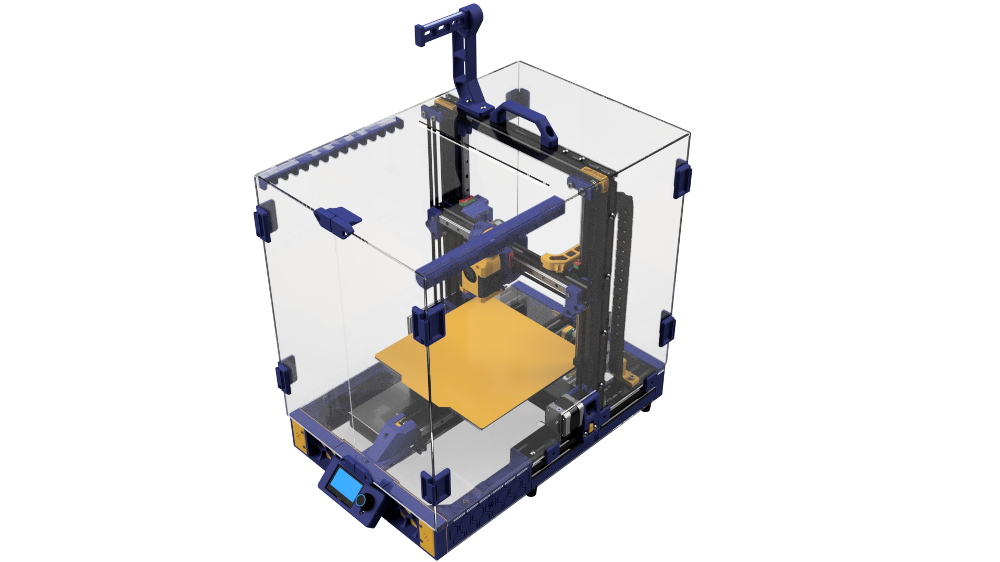
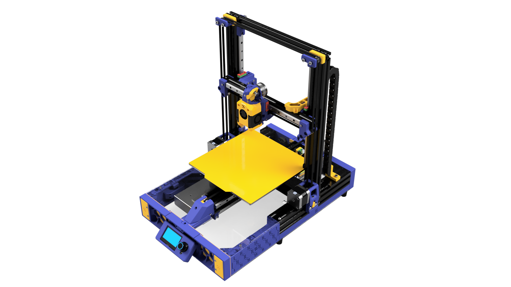
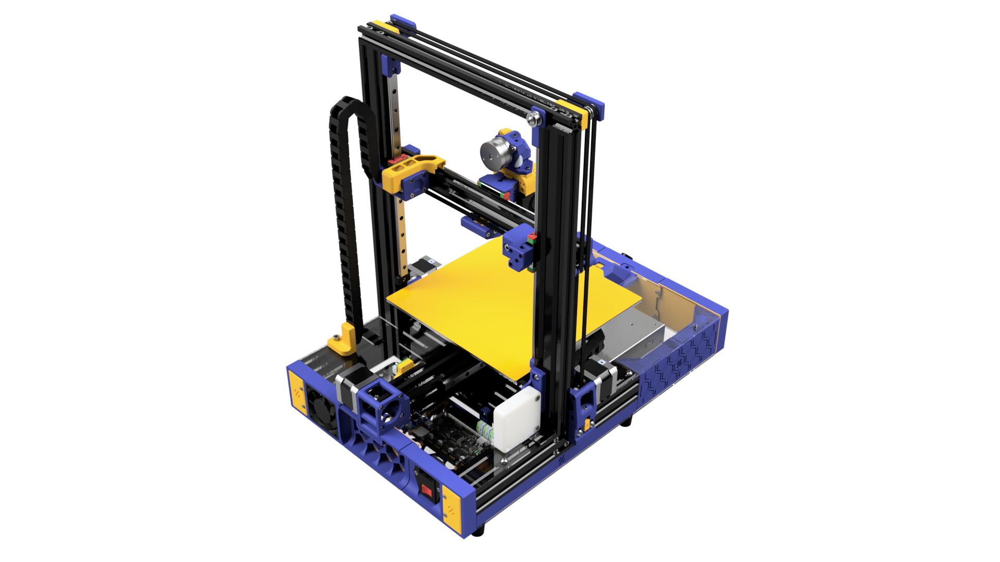
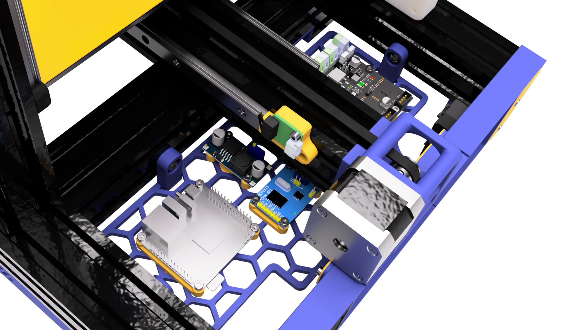

# Ender Switchwire Redux

This is a modern refresh of the Ender 3 to Voron Switchwire conversion project. 

It builds off [boubounokefalos/Ender_SW](https://github.com/boubounokefalos/Ender_SW), and incorporates several new modifications contributed by the community (including me) to bring it up to date with modern standards.

## Images

## Files

- `Ender Switchwire.3mf` - collection of the 3d printed parts, with print settings for Bambu Studio
- `/CAD` - includes fully-assembled `.f3d` and `.step` files, for use as instructions and visualisation
- `/STLS` - contains all the individual 3d printed parts
- `/DXF` - the deck and enclosure panels to cut out of acrylic or any other material
- `/IMG` - renders of the assembled printer

## Features

The base is vanilla Voron, but we have included a few modifications as listed below.\
Each can be mixed & matched with the [original Voron Switchwire](https://github.com/VoronDesign/Voron-Switchwire) parts too.

| Name | Reasoning | Credit |
|:----:|:---------:|:------:|
| [Rapid Burner](https://github.com/chirpy2605/voron/tree/main/V0/Rapid_Burner) &  [Dragon Burner Toolhead](https://github.com/chirpy2605/voron/tree/main/V0/Dragon_Burner) | Lighter & more compact toolhead (CAD uses Dragon, but it is swappable) | [chirpy2605](https://github.com/chirpy2605/voron) |
| [Wristwatch BMG Extruder](https://github.com/bythorsthunder/Voron_Mods/tree/main/Wristwatch_Extruder_BMG) | Lighter, modern, orbiter-like extruder (that is 3d-printed and uses BMG gears) | [bythorsthunder](https://github.com/bythorsthunder/Voron_Mods/tree/main) |
| [EMS (Electronic Management System)](https://github.com/fizzystech/ft_enderwire) | Modular electronics mounting system | [fizzystech](https://github.com/fizzystech/ft_enderwire) |
| [Orange Pi Zero 3](http://www.orangepi.org/html/hardWare/computerAndMicrocontrollers/details/Orange-Pi-Zero-3.html) | Affordable and compact SBC (Klipper is installable with [KIAUH](https://github.com/dw-0/kiauh)) | - |
| [LM2596 Buck Converters](https://www.codrey.com/learn/lm2596s-module-a-trivial-tale/) | Affordable and compact 5V rail | - |
| [MCP2515 CAN Controller](https://how2electronics.com/esp32-can-bus-communication-with-mcp2515-module/) | 4-wire connection to toolhead (optional, and requires [BTT EBB 36](https://global.bttwiki.com/EBB%2036%20CAN.html)) | - |
| [Multi-Color Skirts w/ Fine Mesh](./Ender%20Switchwire.3mf) | Utilise modern multi-color printers | [BillyLjm](https://github.com/BillyLjm/Ender_SW_Redux) |
| [Flush Bottom Extension](./STL/XZ-Axis/Door%20Close%20Mount.stl) | Allows fitting into tight spaces, and reorienting the parts for printing | [BillyLjm](https://github.com/BillyLjm/Ender_SW_Redux) |
| [Door Closer/ Keybak Substitute](./STL/XZ-Axis) | Globally available Keybak substitute (available on Aliexpress, Taobao, etc) | [BillyLjm](https://github.com/BillyLjm/Ender_SW_Redux) |
| [Lift-Off Hinge](./STL/Enclosure) | Easy removal of doors for maintenance | [BillyLjm](https://github.com/BillyLjm/Ender_SW_Redux) |
| [One-Piece Enclosure Panels](./DXF) | More rigid enclosure (but its one color, transparent) | [BillyLjm](https://github.com/BillyLjm/Ender_SW_Redux) |
| [Identical  Top Deck Panels](./DXF) | Swappable halves of the top deck (for easier cutting, tracking, etc) | [BillyLjm](https://github.com/BillyLjm/Ender_SW_Redux) |
| [Y-Limit Switch PCB clearenace](./STL/Y-axis/Y%20Limit%20Switch%20Mount.stl) | Mirrored for PCB pin clearance so the switch is flush with the mount | [BillyLjm](https://github.com/BillyLjm/Ender_SW_Redux) |
| [Voxelab Aquila Specific Parts](./Ender%20Switchwire.3mf) | My conversion of the Voxelab Aquila required a few modified parts | [BillyLjm](https://github.com/BillyLjm/Ender_SW_Redux) |